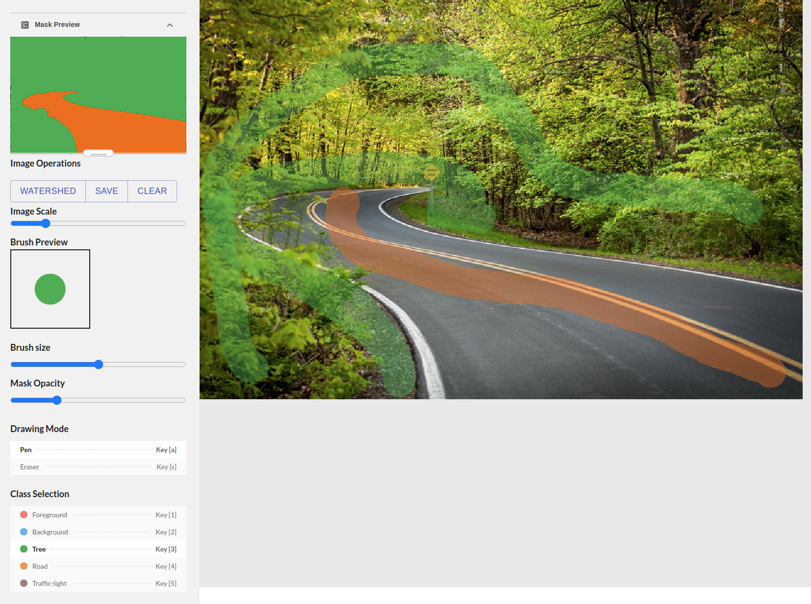
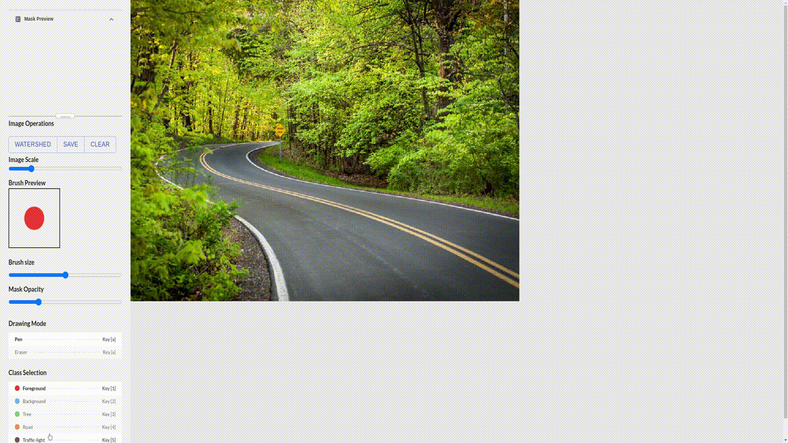
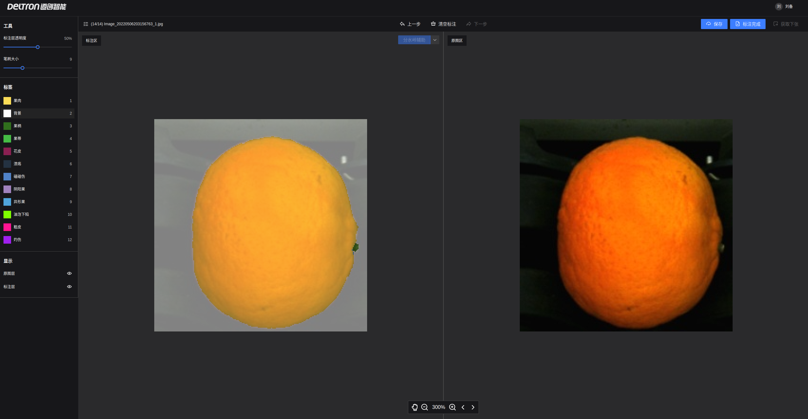

# Pixel Annotation Tool in React

## Introduction
It's a React version of [PixelAnnotationTool](https://github.com/abreheret/PixelAnnotationTool). The implementation borrows ideas from different repos, including:

* [react-magic-painter](https://github.com/codeAdrian/react-magic-painter)
* [react-image-annotate](https://github.com/UniversalDataTool/react-image-annotate)

The tool also uses many excellent packages, such as:

* [react-konva](https://github.com/konvajs/react-konva)
* [use-image](https://github.com/konvajs/use-image)
* [opencv-js](https://github.com/TechStark/opencv-js)

## Demo

[Try the pixel annotation tool here](https://pixel-annotation-tool.netlify.app/)

### UI Overview


### Draw and Generate Mask


## How to use

### Installation
```
npm install
```

### Run the App

```
npm start
```

## Next steps (Roadmap)

I supervised a few engineers in Deltron Intelligence to extend this app for production use. See the figure below:



Key technical challenges have been addressed in another of my repo: [emscripten-vision-react-example](https://github.com/randxie/emscripten-vision-react-example)

## Changelog

- [x] Solve anti-aliasing issue by using findContours and drawContours to handle pixels at edge.

## References

### OpenCV related
1. https://aralroca.com/blog/opencv-in-the-web
1. https://github.com/echamudi/opencv-wasm

### Anti-aliasing related
1. https://medium.com/@kozo002/how-to-draw-without-antialiasing-on-html5-canvas-cf13294a8e58
1. https://github.com/konvajs/konva/issues/695

### Memory-leak related

1. https://github.com/opencv/opencv/issues/15060
